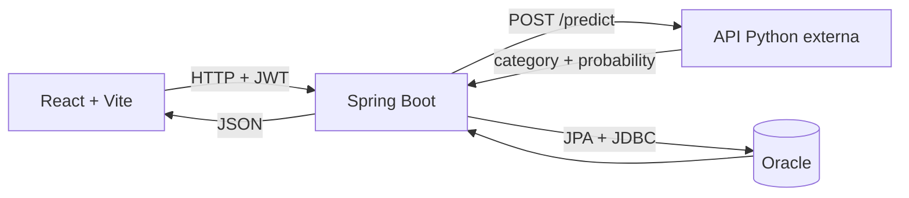

# 1. TechMind

TechMind es un MVP web para registrar usuarios y clasificar contenido técnico mediante un modelo externo. El repositorio contiene una aplicación React y una API Spring Boot que autentica con JWT, consulta el clasificador y persiste el resultado en Oracle.

Repositorio: [No-Country-simulation/G9-LATAM-TEAM-67](https://github.com/No-Country-simulation/G9-LATAM-TEAM-67)

## 2. Descripción

La aplicación recibe un título y un texto técnico. El frontend envía ambos al backend autenticado; Spring Boot concatena título y texto, llama a la API Python y, si obtiene una respuesta válida, guarda la categoría, la probabilidad y el usuario autenticado. El resultado vuelve al navegador para mostrarse en la interfaz.

La API Python no forma parte de este repositorio: debe ejecutarse o estar disponible por separado.

## 3. Problema que resuelve

TechMind centraliza la clasificación de notas o fragmentos técnicos y conserva el resultado asociado a la persona que realizó la solicitud. Así evita que el cliente elija el usuario propietario y mantiene la llamada al modelo fuera del navegador.

## 4. Funcionalidades

- Registro de cuentas con rol inicial `USER`.
- Inicio de sesión y restauración de sesión en el frontend.
- Clasificación real mediante `POST /api/contenido/clasificar`.
- Persistencia de título, texto, categoría, probabilidad, fecha y usuario.
- Consulta de contenidos por lista o identificador.
- CRUD, activación y desactivación de usuarios restringidos a `ADMIN`.
- Respuestas controladas ante timeout, indisponibilidad o respuesta inválida del modelo.
- Documentación interactiva mediante Swagger UI.
- Interfaz clara/oscura durante la sesión actual.
- Ejemplos visuales simulados separados del botón principal de clasificación real.

## 5. Arquitectura



El backend es la única capa que se comunica con Oracle y con el modelo. El navegador no recibe credenciales de base de datos ni puede enviar un `usuarioId` para la clasificación.

## 6. Flujo de clasificación

1. El usuario se registra o inicia sesión.
2. React conserva la respuesta de sesión en `localStorage` bajo la clave `user`.
3. El formulario llama a `POST /api/contenido/clasificar` con `Authorization: Bearer <token>`.
4. Spring Security valida el JWT y carga el usuario activo por correo.
5. Spring concatena `titulo + " " + texto` y envía `{"texto":"..."}` a `CLASSIFIER_API_URL`.
6. La respuesta debe contener `category` no vacío y `probability` entre `0` y `1`.
7. Solo después de validar el modelo se guarda `contenido` con el usuario autenticado.
8. Spring devuelve `201 Created` y React muestra categoría y confianza.

Si el modelo falla, el contenido no se guarda. Los timeouts o problemas de conexión producen `503`; una respuesta HTTP o JSON inválida produce `502`.

## 7. Tecnologías

### Backend

- Java 17.
- Spring Boot 3.5.4.
- Spring Web, Security, Data JPA y Validation.
- Auth0 Java JWT 4.5.0.
- Flyway con soporte para Oracle.
- Oracle JDBC `ojdbc11` 23.4.0.24.05.
- Springdoc OpenAPI 2.8.5.
- JUnit, Spring Test, Mockito y H2 para pruebas.

### Frontend

- React 19.
- TypeScript 5.7.
- Vite 8.
- Tailwind CSS 4 mediante `@tailwindcss/vite`.

Las versiones proceden de `backend/pom.xml` y `front/package.json`.

## 8. Estructura del repositorio

```text
.
├── backend/
│   ├── .mvn/                         # Maven Wrapper
│   ├── src/main/java/.../
│   │   ├── config/                   # Seguridad, CORS y cliente HTTP
│   │   ├── controller/               # Auth, contenidos y usuarios
│   │   ├── dto/, entity/, repository/
│   │   ├── filter/ y security/       # JWT, 401 y 403
│   │   └── service/                  # Autenticación, clasificación y persistencia
│   ├── src/main/resources/
│   │   ├── application.properties
│   │   └── db/migration/             # V1 y V2 de Flyway
│   └── src/test/                     # Suite automatizada backend
├── front/
│   ├── src/
│   │   ├── services/                 # Llamadas HTTP
│   │   ├── UserContext.tsx           # Sesión del navegador
│   │   ├── LandingPage.tsx
│   │   └── Classifier.tsx
│   ├── package.json
│   └── vite.config.ts
└── README.md
```

## 9. Requisitos previos

- Git.
- JDK 17 disponible en `PATH`.
- Acceso a una instancia Oracle compatible y un usuario con permisos para ejecutar las migraciones.
- Node.js compatible con Vite 8. La instalación usada durante la validación ejecutó correctamente el build, pero el repositorio no fija una versión exacta de Node.
- Una API de clasificación compatible con el contrato descrito en la sección 13.
- PowerShell para usar los comandos de Windows mostrados aquí.

No es necesario instalar Maven globalmente: el repositorio incluye `mvnw` y `mvnw.cmd`.

## 10. Variables de entorno

No copies secretos al repositorio. Configúralos en la terminal, en el gestor de secretos del entorno o en la configuración de ejecución del IDE.

```env
DB_URL=
DB_USERNAME=
DB_PASSWORD=
JWT_SECRET=
JWT_EXPIRATION=7200000
CLASSIFIER_API_URL=
CLASSIFIER_CONNECT_TIMEOUT=3000
CLASSIFIER_READ_TIMEOUT=10000
VITE_API_URL=http://localhost:8080
```

| Variable | Componente | Descripción |
|---|---|---|
| `DB_URL` | Backend | URL JDBC completa de Oracle. |
| `DB_USERNAME` | Backend | Usuario de Oracle. |
| `DB_PASSWORD` | Backend | Contraseña de Oracle. |
| `JWT_SECRET` | Backend | Secreto obligatorio para HMAC256; usa un valor largo, aleatorio y privado. |
| `JWT_EXPIRATION` | Backend | Duración del JWT en milisegundos; por defecto `7200000` (2 horas). |
| `CLASSIFIER_API_URL` | Backend | URL completa del endpoint del modelo, incluida la ruta `/predict`. |
| `CLASSIFIER_CONNECT_TIMEOUT` | Backend | Timeout de conexión en milisegundos; por defecto `3000`. |
| `CLASSIFIER_READ_TIMEOUT` | Backend | Timeout de respuesta en milisegundos; por defecto `10000`. |
| `VITE_API_URL` | Frontend | URL base de Spring Boot, sin la ruta del endpoint. |
| `TNS_ADMIN` | Backend, opcional | Directorio del wallet/configuración de red de Oracle. |

Hay plantillas seguras en `backend/.env.example` y `front/.env.example`. Spring y Vite no cargan automáticamente el archivo de ejemplo.

Ejemplo para una sesión de PowerShell, usando valores propios:

```powershell
$env:DB_URL="jdbc:oracle:thin:@..."
$env:DB_USERNAME="..."
$env:DB_PASSWORD="..."
$env:JWT_SECRET="..."
$env:JWT_EXPIRATION="7200000"
$env:CLASSIFIER_API_URL="http://classifier-host:8000/predict"
$env:VITE_API_URL="http://localhost:8080"
```

## 11. Configuración de Oracle

La aplicación usa `oracle.jdbc.OracleDriver` y el dialecto de Oracle. Define `DB_URL`, `DB_USERNAME` y `DB_PASSWORD` antes de arrancar.

Si la conexión necesita Oracle Wallet, define `TNS_ADMIN` con la ruta al directorio del wallet:

```powershell
$env:TNS_ADMIN="C:\ruta\al\wallet"
```

Si `TNS_ADMIN` no existe, la aplicación busca `src/main/resources/wallet` desde el directorio actual o desde `backend/src/main/resources/wallet`. El repositorio no incluye un wallet; no debe versionarse uno con credenciales.

Hibernate usa `ddl-auto=validate`: valida el esquema, pero no lo crea. Flyway es responsable de aplicar la estructura.

## 12. Migraciones Flyway

Flyway está habilitado y ejecuta, en orden:

- `V1__create_table_users.sql`: crea `users`, roles, estado y marcas de tiempo.
- `V2__create_table_contenido.sql`: crea `contenido`, la relación `usuario_id` e índices por usuario y categoría.

Al iniciar el backend, Flyway usa las mismas credenciales de Oracle. `baseline-on-migrate=true` está activo. Revisa los permisos del usuario de base de datos antes del primer arranque.

En pruebas, Flyway se desactiva y JPA crea un esquema H2 en memoria con modo de compatibilidad Oracle.

## 13. Ejecución de la API Python

El código y el comando de arranque de la API Python **no están incluidos** en este repositorio. Inicia el servicio desde su proyecto correspondiente y configura en Spring la URL completa:

```powershell
$env:CLASSIFIER_API_URL="http://localhost:8000/predict"
```

Contrato requerido:

```http
POST /predict
Content-Type: application/json
```

```json
{
  "texto": "API REST con Java Spring Boot y base de datos"
}
```

Respuesta válida:

```json
{
  "category": "No clasificado",
  "probability": 0.4691992561299345
}
```

La respuesta anterior fue obtenida del modelo externo durante la verificación manual. La categoría no se fuerza desde TechMind.

## 14. Ejecución del backend

Desde la raíz del repositorio, después de configurar las variables:

```powershell
cd backend
.\mvnw.cmd spring-boot:run
```

En macOS o Linux:

```bash
cd backend
./mvnw spring-boot:run
```

La API intenta escuchar en `http://localhost:8080`. El arranque falla de forma explícita si falta `JWT_SECRET`; también necesita conexión válida a Oracle para completar Flyway y la inicialización JPA.

## 15. Ejecución del frontend

Configura `VITE_API_URL` antes de construir o arrancar Vite:

```powershell
cd front
$env:VITE_API_URL="http://localhost:8080"
npm run dev
```

Vite escucha en todas las interfaces y usa el puerto `5173` salvo que exista la variable `PORT`. La URL local habitual es `http://localhost:5173`.

El directorio contiene `pnpm-lock.yaml`, pero no declara `packageManager`. En la validación actual, `npm install` falla con `EUNSUPPORTEDPROTOCOL` para una referencia `workspace:*`; por eso una instalación limpia y reproducible de dependencias queda como limitación conocida. Si ya existen dependencias instaladas, `npm run dev` y `npm run build` funcionan.

## 16. Autenticación

El registro público crea siempre un usuario activo con rol `USER` y guarda la contraseña con BCrypt. El login autentica correo y contraseña y devuelve un JWT HMAC256 cuyo `subject` es el correo y cuya claim `role` contiene el rol.

El cliente conserva el objeto `{id, name, email, role, token}` en `localStorage` con la clave `user`. `UserContext` lo restaura al recargar. Para rutas protegidas envía:

```http
Authorization: Bearer <token>
```

No registres el token en logs ni lo incluyas en reportes. Un token ausente o inválido produce `401`; un usuario autenticado sin el rol requerido produce `403`.

## 17. Endpoints

### Resumen

| Método | Ruta | Autenticación | Rol | Resultado principal |
|---|---|---|---|---|
| `POST` | `/auth/register` | No | Público | Registra un usuario `USER`; `201`. |
| `POST` | `/auth/login` | No | Público | Devuelve sesión y JWT; `200`. |
| `POST` | `/api/contenido/clasificar` | Bearer JWT | `USER` o `ADMIN` | Clasifica y persiste; `201`. |
| `POST` | `/api/contenido` | Bearer JWT | `USER` o `ADMIN` | Crea contenido con resultado simulado; `201`. |
| `GET` | `/api/contenido` | Bearer JWT | `USER` o `ADMIN` | Lista contenidos; `200`. |
| `GET` | `/api/contenido/{id}` | Bearer JWT | `USER` o `ADMIN` | Obtiene un contenido; `200`. |
| `GET` | `/users` | Bearer JWT | `ADMIN` | Lista usuarios; `200`. |
| `GET` | `/users/{id}` | Bearer JWT | `ADMIN` | Obtiene un usuario; `200`. |
| `POST` | `/users` | Bearer JWT | `ADMIN` | Crea un usuario con rol indicado; `201`. |
| `PUT` | `/users/{id}` | Bearer JWT | `ADMIN` | Actualiza campos enviados; `200`. |
| `PATCH` | `/users/{id}/activate` | Bearer JWT | `ADMIN` | Activa un usuario; `200`. |
| `PATCH` | `/users/{id}/deactivate` | Bearer JWT | `ADMIN` | Desactiva un usuario; `200`. |
| `DELETE` | `/users/{id}` | Bearer JWT | `ADMIN` | Elimina un usuario; `204`. |
| `GET` | `/v3/api-docs` | No | Público | Especificación OpenAPI. |
| `GET` | `/swagger-ui/index.html` | No | Público | Swagger UI. |

### Cuerpos y errores relevantes

`POST /auth/register` recibe `name`, `email` y `password` (mínimo 3 caracteres). Responde con `id`, `name` y `email`. Puede devolver `400` por validación o `409` si el correo ya existe.

`POST /auth/login` recibe `email` y `password`. Responde con `token`, `id`, `name`, `email` y `role`. Puede devolver `400`, `401` por credenciales inválidas o `403` si el usuario está desactivado.

Las solicitudes que crean o clasifican contenido reciben `titulo` no vacío, máximo 150 caracteres, y `texto` entre 10 y 10000 caracteres. La clasificación puede devolver `400`, `401`, `403`, `502` o `503`. Un identificador inexistente devuelve `404`.

`POST /users` recibe `name`, `email`, `password` y `role` (`USER` o `ADMIN`). `PUT /users/{id}` acepta esos campos y `active` de forma opcional. Todo `/users/**` devuelve `401` sin sesión y `403` para un usuario `USER`.

Los errores controlados usan este formato:

```json
{
  "timestamp": "2026-08-01T20:30:00",
  "status": 503,
  "error": "Servicio de clasificación no disponible",
  "message": "No fue posible obtener una respuesta del modelo.",
  "path": "/api/contenido/clasificar"
}
```

## 18. Ejemplos de solicitud y respuesta

### Registro

```http
POST /auth/register
Content-Type: application/json
```

```json
{
  "name": "Ada Lovelace",
  "email": "ada@example.com",
  "password": "una-clave-privada"
}
```

```json
{
  "id": 1,
  "name": "Ada Lovelace",
  "email": "ada@example.com"
}
```

### Login

```json
{
  "email": "ada@example.com",
  "password": "una-clave-privada"
}
```

Respuesta sanitizada:

```json
{
  "token": "<JWT oculto>",
  "id": 1,
  "name": "Ada Lovelace",
  "email": "ada@example.com",
  "role": "USER"
}
```

### Clasificación mediante TechMind

```http
POST /api/contenido/clasificar
Authorization: Bearer <JWT oculto>
Content-Type: application/json
```

```json
{
  "titulo": "Clasificador de documentación",
  "texto": "Modelo de inteligencia artificial desplegado en infraestructura cloud para inferencia y machine learning."
}
```

La forma de la respuesta de TechMind es:

```json
{
  "id": 42,
  "titulo": "Clasificador de documentación",
  "texto": "Modelo de inteligencia artificial desplegado en infraestructura cloud para inferencia y machine learning.",
  "categoria": "No clasificado",
  "probabilidad": 0.426646,
  "fecha": "2026-08-01T21:50:00"
}
```

El `id` y la `fecha` son representativos porque la verificación E2E con Oracle no pudo completarse sin credenciales. La categoría y probabilidad sí proceden de una llamada real al modelo.

### Tres entradas verificadas con el modelo externo

Durante la verificación manual se enviaron estos tres contenidos al contrato real `/predict`; se conservan también los fallos observados para no presentar resultados inventados:

1. Backend

   ```json
   {
     "titulo": "API backend",
     "texto": "API REST con Java Spring Boot, autenticación JWT, Hibernate y persistencia Oracle."
   }
   ```

   Resultado observado: HTTP `400` del modelo externo, sin categoría válida.

2. Frontend

   ```json
   {
     "titulo": "Interfaz web",
     "texto": "Aplicación web con React, TypeScript, Vite, componentes y estilos CSS responsivos."
   }
   ```

   Resultado observado: HTTP `400` del modelo externo, sin categoría válida.

3. Inteligencia artificial/Cloud

   ```json
   {
     "titulo": "Modelo en la nube",
     "texto": "Modelo de inteligencia artificial desplegado en infraestructura cloud para inferencia y machine learning."
   }
   ```

   Respuesta real sanitizada del modelo:

   ```json
   {
     "category": "No clasificado",
     "probability": 0.426646
   }
   ```

Estas pruebas directas no confirman persistencia en Oracle; esa parte requiere un entorno configurado.

## 19. Pruebas

### Backend

La suite usa H2 en memoria con modo Oracle, Flyway desactivado y mocks para no llamar a la API Python real.

```powershell
cd backend
.\mvnw.cmd clean test
```

En macOS o Linux:

```bash
cd backend
./mvnw clean test
```

La suite cubre autenticación, validación, JWT, autorización de usuarios, clasificación, persistencia, asociación con usuario y errores del modelo. Actualmente contiene 34 pruebas.

### Frontend

No existe todavía un runner de pruebas frontend. La verificación disponible es el build de producción:

```powershell
cd front
$env:VITE_API_URL="http://localhost:8080"
npm run build
```

## 20. Integración con OCI

La integración demostrable en el código es con **Oracle Database mediante JDBC**, incluidas dependencias de Oracle, soporte de Oracle Wallet y migraciones SQL compatibles con Oracle.

El repositorio no contiene Terraform, configuración de despliegue, OCID, nombre de Autonomous Database ni evidencia suficiente para identificar el producto OCI concreto que aloja la base o la API externa. Por ello no se afirma uso de OCI Compute, Functions, Object Storage ni otro servicio específico.

Para un despliegue futuro podrían evaluarse un gestor de secretos, observabilidad e infraestructura como código en OCI, pero esas capacidades no están implementadas actualmente.

## 21. Seguridad

- Las contraseñas se almacenan con BCrypt y nunca se devuelven en los DTO de respuesta.
- Los JWT se firman con HMAC256 y un `JWT_SECRET` obligatorio sin valor predeterminado.
- La duración predeterminada es 7 200 000 ms (2 horas) y puede cambiarse con `JWT_EXPIRATION`.
- Los roles persistidos son `USER` y `ADMIN`; Spring los convierte en `ROLE_USER` y `ROLE_ADMIN`.
- Solo registro, login, Swagger y OpenAPI son públicos.
- `/api/contenido/**` requiere `USER` o `ADMIN`.
- `/users/**` requiere `ADMIN`.
- La clasificación obtiene el usuario desde el contexto autenticado, no desde el cuerpo del cliente.
- El backend es stateless, deshabilita CSRF y acepta CORS desde `http://localhost:5173`.
- Los errores controlados no incluyen stack traces ni secretos.

El JWT se almacena actualmente en `localStorage`. Esto facilita restaurar la sesión, pero un XSS podría leerlo; no debe considerarse un almacenamiento completamente seguro.

## 22. Limitaciones conocidas

- La API Python y sus instrucciones de despliegue no están incluidas.
- El modelo externo devolvió `400` para dos de los tres ejemplos técnicos de la verificación manual.
- No se completó una prueba E2E contra Oracle porque las credenciales no estaban disponibles en el entorno de validación.
- `npm install` falla actualmente con `EUNSUPPORTEDPROTOCOL` para una referencia `workspace:*`; falta fijar y comprobar un flujo limpio de instalación frontend.
- No hay pruebas automatizadas frontend.
- Los botones de ejemplos del clasificador usan resultados simulados; solo el botón principal consume la API real.
- `POST /api/contenido` conserva una clasificación simulada `Backend` con probabilidad `0.90`; no debe confundirse con `/clasificar`.
- La recuperación de contraseña no está implementada aunque la interfaz muestra el enlace.
- “Recordarme” no cambia el comportamiento: la sesión se guarda siempre en `localStorage`.
- El modo oscuro no se persiste después de recargar.
- El JWT en `localStorage` está expuesto al riesgo de XSS.
- CORS está fijado a `http://localhost:5173` y no está externalizado para otros despliegues.
- La configuración CORS no incluye actualmente el método `PATCH`, aunque el controlador administrativo expone activación y desactivación con ese método.
- El registro público solo crea `USER`; el repositorio no incluye un proceso de bootstrap para el primer `ADMIN`.
- La migración permite `contenido.usuario_id` nulo; el endpoint real de clasificación sí exige un usuario autenticado, pero la ruta simulada crea contenido sin usuario.

## 23. Próximas mejoras

- Investigar los `400` devueltos por el modelo y versionar su contrato/despliegue.
- Reparar y fijar la instalación limpia del frontend, incluida la versión de Node y el gestor de paquetes.
- Añadir Vitest y React Testing Library para sesión, JWT, carga y errores `401`, `502` y `503`.
- Migrar la sesión a una estrategia que reduzca la exposición a XSS, evaluando cookies `HttpOnly` con protecciones CSRF apropiadas.
- Implementar recuperación de contraseña y dar comportamiento real a “Recordarme”.
- Persistir la preferencia de tema.
- Externalizar orígenes CORS por ambiente.
- Alinear la nulabilidad de `usuario_id` con el flujo autenticado si se retira la ruta simulada.
- Añadir infraestructura reproducible y documentación de despliegue cuando exista una decisión concreta sobre OCI.

## 24. Equipo

El historial Git identifica contribuciones de:

- GuillenA7
- GinAlonso / Georgina Alonso
- Henry Peralta Briceño
- German Reyes
- abiquintana
- ValeRuizTo / Valentina Ruiz Torres
- Jorge Andrés Rodríguez

Los perfiles o responsabilidades individuales no están documentados en el repositorio.

## 25. Licencia

El repositorio no contiene un archivo de licencia para TechMind. Hasta que el equipo publique una licencia, no debe asumirse permiso de uso, modificación o distribución fuera de lo permitido por la legislación aplicable.
