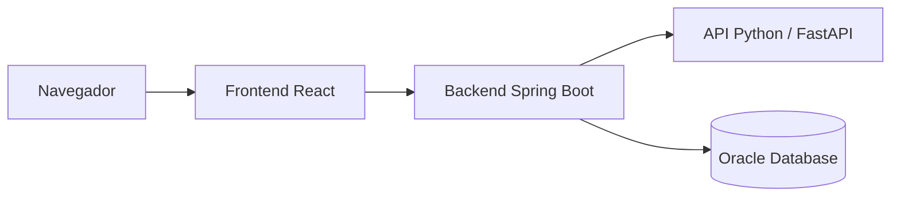

# TechMind

TechMind organiza contenido técnico mediante clasificación automática. Permite registrar usuarios, iniciar sesión, clasificar textos, consultar una biblioteca personal y filtrar contenidos por categoría. Los administradores disponen además de una vista global de contenidos y de gestión de usuarios.

## Problema que resuelve

Los equipos acumulan documentación técnica difícil de localizar y ordenar. TechMind consulta un modelo de aprendizaje automático, guarda la categoría y su probabilidad junto con el usuario autenticado y permite recuperar después ese conocimiento.

## Arquitectura



El frontend no se comunica directamente con el modelo ni con Oracle. El backend valida el JWT, aplica el alcance de datos, consulta el clasificador y persiste el resultado.

## Componentes

| Componente | Responsabilidad | Tecnologías | Documentación |
|---|---|---|---|
| `backend` | API, seguridad, persistencia y coordinación | Java 17, Spring Boot 3.5.4, Oracle, Flyway | [Backend](backend/README.md) |
| `frontend` | Interfaz web, sesión y consumo de API | React 19, TypeScript, Vite 8, Tailwind CSS 4 | [Frontend](frontend/README.md) |
| `datascience` | Datos, entrenamiento y artefactos | Python, pandas, NLTK, scikit-learn, joblib | [Ciencia de datos](datascience/README.md) |
| `python-api` | Servicio HTTP de inferencia | Python 3.12 en Docker, FastAPI, Uvicorn | [API Python](python-api/README.md) |

## Estructura

```text
backend/       API de Spring Boot y migraciones
frontend/      aplicación React y configuración de Nginx
datascience/   notebook, dataset, metadatos y pipeline entrenado
python-api/    servicio FastAPI y copia del pipeline
docker-compose.yml
```

## Inicio rápido

Requisitos generales: Git, Java 17, Node.js con Corepack, Python si la API se ejecuta fuera de Docker, Docker Compose para contenedores y acceso a Oracle. Una conexión mediante alias TNS también requiere un Oracle Wallet local.

Orden recomendado:

1. Configurar y arrancar la [API Python](python-api/README.md).
2. Preparar variables y arrancar el [backend](backend/README.md).
3. Configurar `VITE_API_URL` y arrancar el [frontend](frontend/README.md).

El `docker-compose.yml` raíz construye los tres servicios, pero requiere proporcionar las variables del backend, `VITE_API_URL` y un wallet externo en la ubicación indicada.

## Flujo principal

1. El usuario se registra o inicia sesión.
2. React conserva la sesión y envía el JWT como `Authorization: Bearer …`.
3. Spring Security autentica al usuario.
4. El backend concatena título y texto y llama al clasificador.
5. FastAPI devuelve `category` y `probability`.
6. El backend valida y guarda el resultado asociado al usuario.
7. React muestra el resultado y permite consultarlo en la biblioteca.

## Seguridad

- Las contraseñas se codifican con BCrypt.
- La API usa JWT stateless y roles `USER` y `ADMIN`.
- Los secretos, archivos `.env`, wallets y cachés locales están excluidos de Git.
- El frontend guarda actualmente la sesión en `localStorage`, lo que implica riesgo ante XSS.
- Las credenciales históricamente expuestas deben rotarse fuera del repositorio.

## Pruebas

- Backend: suite con Spring Test, JUnit, Mockito y H2 mediante Maven Wrapper.
- Frontend: comprobación TypeScript y build; no hay runner de pruebas automatizadas.
- Ciencia de datos: evaluación versionada en el notebook, sin suite automatizada.
- API Python: no contiene pruebas automatizadas versionadas.

## Limitaciones conocidas

- Los ejemplos rápidos del clasificador son simulados; el formulario principal sí usa la API real.
- «Probar sin cuenta» muestra un aviso y no habilita una sesión invitada.
- No hay recuperación de contraseña.
- El modo oscuro no se conserva al recargar.
- El JWT se almacena en `localStorage`.
- La clasificación depende de la API Python y Oracle.
- El notebook no fija las versiones de sus dependencias.

## Equipo

- Henry Peralta — Full Stack Developer
- Georgina Ovando Alonso — Backend Developer
- German Oswaldo Reyes Perdido — Backend Developer
- Jose Adrian Guillen Lamas — Backend Developer
- Jorge Andrés Rodríguez Romero — Data Scientist
- Abi Mariel Quintana — Data Scientist
- Valentina Ruiz Torres — Architect (Software / Solution Architect)

## Licencia

El repositorio no contiene actualmente un archivo de licencia.
